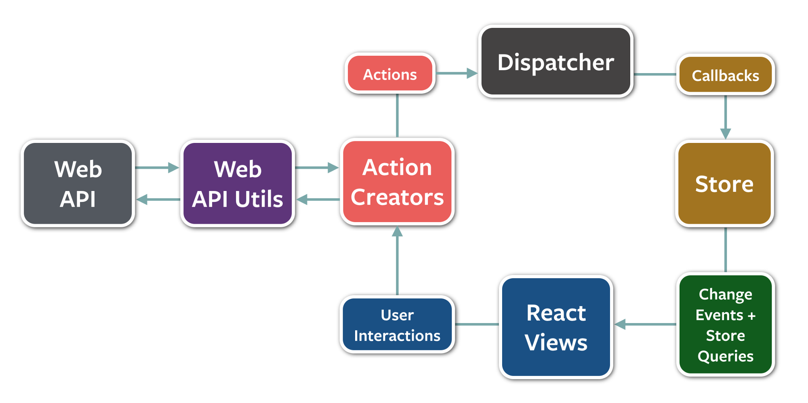

# A brief history of the web

::: notes
- motivation is to give a bit of context for client side web apps
- why has the industry settled on this methodology
:::

## Generation 1

Server rendered web pages

MVC becomes the de facto architecture

- 1995 - PHP
- 2005 - Ruby on Rails
- 2005 - Django

::: notes
- server responsible for rendering every page
- tight coupling between the backend and ui
  - monolithic
- MVC becomes the de facto architecture
:::

## Generation 2

Client side apps

::: {.columns}
::: {.column width="50%"}
#### Web server frameworks
- 2010 - Flask
- 2010 - Express.js
:::
::: {.column width="50%"}
#### Client side web frameworks
- 2010 - Backbone.js
- 2011 - AngularJS
- 2011 - Ember.js
:::
:::

::: notes
- web browsers became more powerful
  - we begin to think about the browser as a platform itself
  - js became ubiquitous
- work from the server was offloaded to the client as a result
- server side dynamic was changing
  - microservices, approx 2005 - Borg, 2010 - Mesos, 2012 - Eureka / Hystrix
- required the view to be separate from the server side logic
- idea of a SPA was created as entire web apps could be created from a single
  page
  - MVC architecture on the front end
  - client side routing
:::

## Generation 2 - Problems

- Traditional MVC does not scale on the client side
- State management is complex

::: notes
- MVC client side apps are difficult to maintain
  - do not scale
  - cannot use the same approach as with completely server rendered apps
  - not just a single output of html to the browser
- in particular state management becomes overly complex
:::

## Generation 2 - Problems

::: notes
- a certain change in the model could have many side effects
- AngularJS was notorious for being non-performant, because of dirty checking
  to keep the model and view in sync
:::

# Generation 3

## React

Kickstarted the componentization craze

## Redux

## Generation 4
